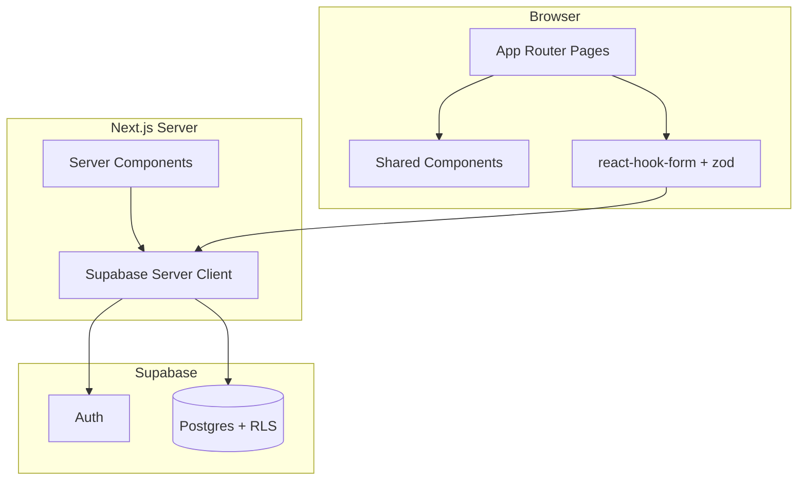

# Architecture

## Tech stack

| Layer | Technology |
|-------|------------|
| Framework | Next.js 16 (App Router) |
| Language | TypeScript |
| Styling | Tailwind CSS v4 |
| Components | shadcn/ui (base-nova style) |
| Auth & DB | Supabase Auth + Postgres |
| Charts | Recharts |
| Dates | date-fns |
| Forms | react-hook-form + zod |
| Icons | lucide-react |
| Hosting | Vercel |

## High-level diagram



## Folder structure

```
src/
├── app/
│   ├── layout.tsx              # Root: dark theme, fonts, metadata
│   ├── page.tsx                # Redirect → /dashboard
│   ├── globals.css             # Theme tokens
│   ├── (auth)/
│   │   ├── layout.tsx          # Centered auth layout
│   │   └── auth/
│   │       ├── login/page.tsx
│   │       └── signup/page.tsx
│   └── (app)/
│       ├── layout.tsx          # Pass-through (pages use AppShell)
│       ├── dashboard/page.tsx
│       ├── plans/...
│       ├── transactions/new/page.tsx
│       ├── insights/page.tsx
│       └── settings/page.tsx
├── components/
│   ├── layout/                 # AppShell, MobileHeader, BottomNav
│   ├── shared/                 # EmptyState, FAB, PageSkeleton, ErrorState
│   ├── providers/              # AppProviders (Toaster)
│   ├── auth/                   # LoginForm, SignupForm
│   ├── forms/                  # PlanForm, TransactionForm
│   ├── plans/                  # Plan cards, detail sections
│   ├── dashboard/              # Dashboard cards, chart
│   ├── insights/               # Health score, simulator, allocation
│   ├── settings/               # Profile form, exports, danger zone
│   └── ui/                     # shadcn primitives
├── config/
│   └── navigation.ts           # Bottom nav items (single source)
└── lib/
    ├── calculations/           # Pure savings math
    ├── plans/                  # enrich, fetch, filter
    ├── dashboard/              # Dashboard aggregates
    ├── insights/               # Health score, allocate, simulate
    ├── settings/               # Profile fetch, CSV export helpers
    ├── transactions/           # Withdrawal delay, parse-transaction-type
    ├── env.ts                  # Public env validation (zod)
    ├── utils.ts                # cn()
    ├── format-inr.ts           # INR display helpers
    └── supabase/
        ├── client.ts           # Browser client
        └── server.ts           # Server client (cookies)
```

## Route groups

| Group | Layout | Bottom nav |
|-------|--------|------------|
| `(auth)` | Centered card, branding | Hidden |
| `(app)` | Per-page `AppShell` | Shown (unless `hideNav`) |

## Layout pattern

Each app page wraps content in `AppShell`:

```
AppShell
├── MobileHeader (title, optional back, optional right slot)
├── main (max-w-lg mx-auto, pb-24 for nav clearance)
└── BottomNav (fixed, safe-area aware)
```

Navigation config lives in `src/config/navigation.ts`.

## Component boundaries

| Component | Server / Client |
|-----------|-----------------|
| AppShell | Server (imports client BottomNav) |
| BottomNav | Client (`usePathname`) |
| Auth forms | Client |
| Plan/Transaction forms | Client |
| Insights chart | Client |
| Settings page | Client |

## Data flow (target MVP)

1. User submits form → client validates with zod
2. Convert display rupees → paise (`Math.round(rupees * 100)`)
3. Call Supabase via server action
4. RLS ensures `user_id = auth.uid()`
5. Client toast + `router.push` / `router.refresh` (or `revalidatePath` in action)

## Theme tokens

Defined in `src/app/globals.css` via shadcn CSS variables:

| Token | Hex | Usage |
|-------|-----|-------|
| `--background` | `#0B1120` | Page background |
| `--card` | `#111827` | Cards, header, nav |
| `--primary` | `#10B981` | CTAs, active nav |

Dark mode forced on `<html className="dark">`.

## Key utilities

```typescript
// src/lib/format-inr.ts
formatINR(amountPaise: number): string       // ₹1,234.56
formatCompactINR(amountPaise: number): string // ₹1.25L, ₹10K, ₹1Cr
```

## Environment

Copy `.env.example` → `.env.local`:

```
NEXT_PUBLIC_SUPABASE_URL=
NEXT_PUBLIC_SUPABASE_ANON_KEY=
# NEXT_PUBLIC_APP_URL=   # optional, production URL
```

## Build and deploy

```bash
npm run dev      # Local development
npm run build    # Production build (must pass before deploy)
npm run lint     # ESLint
```

Deploy to Vercel; set env vars in project settings.

---

## Authentication (added 2026-05-23)

See [auth.md](./auth.md) for full detail.

### Additional files

```
src/
├── middleware.ts                    # Session refresh + route guards
├── lib/
│   ├── auth/routes.ts               # isProtectedPath, isAuthPath
│   └── supabase/middleware.ts       # updateSession()
└── app/(app)/settings/actions.ts    # logout server action
```

### Auth request flow

1. Every matched request hits `src/middleware.ts`
2. `updateSession()` creates server client, calls `getUser()`, refreshes cookies
3. If path is protected and no user → redirect `/auth/login`
4. If path is auth page and user exists → redirect `/dashboard`
5. Login/signup use browser client; logout uses server client + `redirect`

### Middleware matcher

Excludes static assets (`_next/static`, images, favicon). Full pattern in `src/middleware.ts`.

---

## Database schema (added 2026-05-23)

See [schema.md](./schema.md).

```
supabase/migrations/001_initial_schema.sql
```

Tables: `profiles`, `savings_plans`, `savings_transactions`, `monthly_snapshots`. RLS + indexes included. App inserts into `savings_plans` on plan create.

---

## Savings plans (added 2026-05-23)

See [plans.md](./plans.md).

```
src/app/(app)/plans/
├── actions.ts              # createPlan server action
├── new/page.tsx            # create UI
└── ...
src/components/forms/plan-form.tsx
src/config/plan-options.ts  # PLAN_CATEGORIES, PLAN_PRIORITIES
```

---

## Calculations library (added 2026-05-23)

See [calculations.md](./calculations.md).

```
src/lib/calculations/
├── types.ts
├── savings.ts       # balance, progress, health
└── projections.ts   # completion date
```

Pure functions; consumed by UI in a future phase.

---

## Plans data layer (added 2026-05-23)

See [plans.md](./plans.md).

```
src/lib/plans/
├── types.ts
├── enrich-plan.ts
├── get-plans-with-stats.ts
├── get-plan-detail.ts
└── filter-plans.ts

src/components/plans/
├── plan-card.tsx, plans-view.tsx, plan-health-badge.tsx
└── plan-detail-*.tsx (ring, stats, projection, actions, transaction list)
```

---

## Transactions (added 2026-05-23)

See [transactions.md](./transactions.md).

```
src/app/(app)/transactions/actions.ts    # createTransaction
src/config/transaction-options.ts
src/lib/transactions/estimate-withdrawal-delay.ts
src/components/forms/transaction-form.tsx
```

---

## Dashboard (added 2026-05-23)

See [dashboard.md](./dashboard.md).

```
src/lib/dashboard/
├── get-dashboard-data.ts
├── aggregate-metrics.ts
├── generate-insights.ts
└── period-savings.ts

src/components/dashboard/
```

`/dashboard` is a dynamic server route (`getDashboardData`).

---

## Insights (added 2026-05-23)

See [insights.md](./insights.md).

```
src/lib/insights/
├── health-score.ts
├── simulate-extra-savings.ts
├── recommend-allocation.ts
├── generate-narrative.ts
└── get-insights-data.ts

src/components/insights/
```

Client islands: simulator, allocation, monthly chart.

---

## Data flow (current — added 2026-05-23)

Supersedes the “target MVP” bullet list above for shipped features:

1. Server page calls `get*Data()` → Supabase fetch plans + transactions
2. `enrichPlanWithStats` applies `src/lib/calculations/savings.ts` per plan
3. Forms submit via server actions → paise → insert → `{ success, redirectTo }`
4. Client: Sonner toast + `router.push` / `refresh`
5. RLS enforces `user_id = auth.uid()`
6. No client-side cache layer yet; navigation refresh on push

---

## Settings (added 2026-05-23)

See [settings.md](./settings.md).

```
src/lib/settings/
├── get-settings-data.ts
├── csv.ts
└── types.ts

src/app/(app)/settings/
├── page.tsx          # async server page
└── actions.ts        # logout, updateProfile, export, delete

src/components/settings/
```

`/settings` is a dynamic server route. Uses shadcn `AlertDialog` for destructive confirmations.

---

## Environment validation (added 2026-05-23)

```
src/lib/env.ts              # getPublicEnv(), assertPublicEnv() — zod
src/instrumentation.ts      # assert on Node.js startup
.env.example                # committed template
```

All Supabase clients call `getPublicEnv()` instead of `process.env.*!`.

Optional: `NEXT_PUBLIC_APP_URL` for `metadataBase` in root layout.

---

## Mobile polish & PWA (added 2026-05-23)

```
src/components/providers/app-providers.tsx   # Sonner Toaster
src/components/shared/PageSkeleton.tsx
src/components/shared/ErrorState.tsx
src/lib/form-styles.ts
public/manifest.json                       # RupeeRise, standalone
public/icons/*.svg
```

CSS utilities in `globals.css`: `page-content`, `safe-top`, `safe-bottom`, `app-main-padding`, `app-fab-bottom`.

User-facing brand: **RupeeRise** (see root layout metadata).

---

## Production routes & boundaries (added 2026-05-23)

```
src/app/error.tsx              # Root client error boundary
src/app/not-found.tsx          # Global 404
src/app/(app)/error.tsx        # App-scoped error (AppShell)
src/app/robots.ts              # Disallow private routes
src/app/(app)/*/loading.tsx    # Skeleton loaders
```

---

## Server / client boundary (added 2026-05-23)

| Module | Must be |
|--------|---------|
| `parse-transaction-type.ts` | Server-safe (no `"use client"`) |
| `transaction-form.tsx` | Client only — do not import helpers into RSC pages |
| Server actions | Return `{ success, redirectTo }` or `{ error }`; client shows toast + `router.push` |

Example: `/transactions/new/page.tsx` imports `parseTransactionType` from `@/lib/transactions/parse-transaction-type`.

---

## Deploy

See [deploy.md](./deploy.md) and root [README.md](../README.md).

---

## Expenses module (planned v2 — 2026-05-23)

Not in codebase yet. See [expenses.md](./expenses.md).

```
src/config/expense-options.ts
src/lib/expenses/
  types.ts
  get-expenses.ts
  get-expense-summary.ts
src/lib/cashflow/
  get-monthly-cashflow.ts
  aggregate-cashflow.ts
src/app/(app)/expenses/
  page.tsx
  new/page.tsx
  [id]/page.tsx
  actions.ts
  loading.tsx
src/components/expenses/
  expense-form.tsx
  expense-list.tsx
  expense-category-picker.tsx
  cash-flow-card.tsx          # used on dashboard
```

**Middleware:** add `/expenses` to protected paths in `src/lib/auth/routes.ts`.

**Nav:** center Add → `/expenses/new`; savings log remains `/transactions/new` or plan detail actions.
