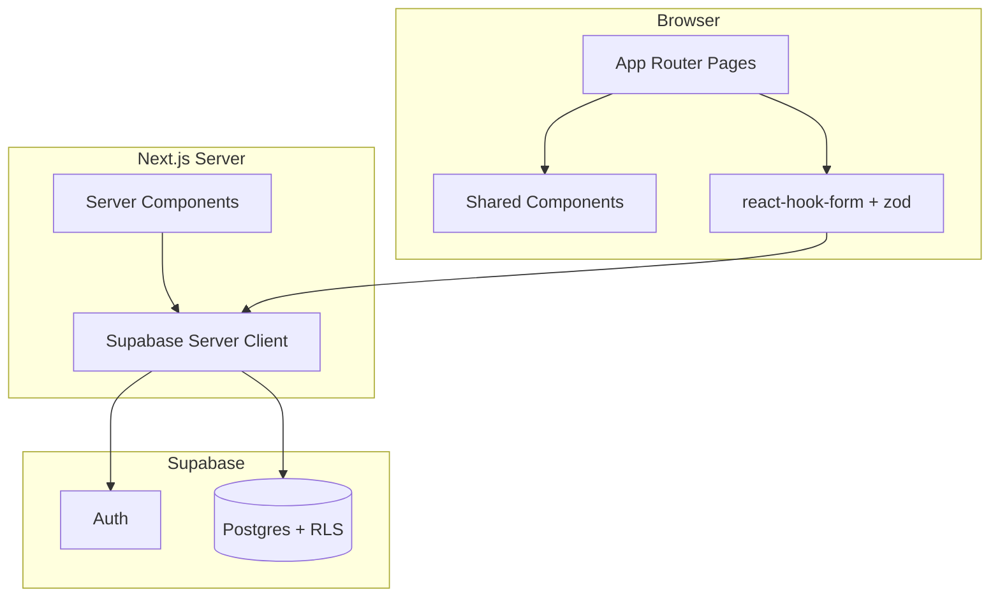

# Architecture

## Tech stack

| Layer | Technology |
|-------|------------|
| Framework | Next.js 16 (App Router) |
| Language | TypeScript |
| Styling | Tailwind CSS v4 |
| Components | shadcn/ui (base-nova style) |
| Auth & DB | Supabase Auth + Postgres |
| Charts | Recharts |
| Dates | date-fns |
| Forms | react-hook-form + zod |
| Icons | lucide-react |
| Hosting | Vercel |

## High-level diagram



## Folder structure

```
src/
├── app/
│   ├── layout.tsx              # Root: dark theme, fonts, metadata
│   ├── page.tsx                # Redirect → /dashboard
│   ├── globals.css             # Theme tokens
│   ├── (auth)/
│   │   ├── layout.tsx          # Centered auth layout
│   │   └── auth/
│   │       ├── login/page.tsx
│   │       └── signup/page.tsx
│   └── (app)/
│       ├── layout.tsx          # Pass-through (pages use AppShell)
│       ├── dashboard/page.tsx
│       ├── plans/...
│       ├── transactions/new/page.tsx
│       ├── insights/page.tsx
│       └── settings/page.tsx
├── components/
│   ├── layout/                 # AppShell, MobileHeader, BottomNav
│   ├── shared/                 # EmptyState, StatCard, FAB
│   ├── auth/                   # LoginForm, SignupForm
│   ├── forms/                  # PlanForm, TransactionForm
│   ├── insights/               # Chart placeholders
│   └── ui/                     # shadcn primitives
├── config/
│   └── navigation.ts           # Bottom nav items (single source)
└── lib/
    ├── utils.ts                # cn()
    ├── format-inr.ts           # INR display helpers
    └── supabase/
        ├── client.ts           # Browser client
        └── server.ts           # Server client (cookies)
```

## Route groups

| Group | Layout | Bottom nav |
|-------|--------|------------|
| `(auth)` | Centered card, branding | Hidden |
| `(app)` | Per-page `AppShell` | Shown (unless `hideNav`) |

## Layout pattern

Each app page wraps content in `AppShell`:

```
AppShell
├── MobileHeader (title, optional back, optional right slot)
├── main (max-w-lg mx-auto, pb-24 for nav clearance)
└── BottomNav (fixed, safe-area aware)
```

Navigation config lives in `src/config/navigation.ts`.

## Component boundaries

| Component | Server / Client |
|-----------|-----------------|
| AppShell | Server (imports client BottomNav) |
| BottomNav | Client (`usePathname`) |
| Auth forms | Client |
| Plan/Transaction forms | Client |
| Insights chart | Client |
| Settings page | Client |

## Data flow (target MVP)

1. User submits form → client validates with zod
2. Convert display rupees → paise (`Math.round(rupees * 100)`)
3. Call Supabase (insert/update) via server action or client
4. RLS ensures `user_id = auth.uid()`
5. Revalidate path / refresh UI

## Theme tokens

Defined in `src/app/globals.css` via shadcn CSS variables:

| Token | Hex | Usage |
|-------|-----|-------|
| `--background` | `#0B1120` | Page background |
| `--card` | `#111827` | Cards, header, nav |
| `--primary` | `#10B981` | CTAs, active nav |

Dark mode forced on `<html className="dark">`.

## Key utilities

```typescript
// src/lib/format-inr.ts
formatINR(amountPaise: number): string       // ₹1,234.56
formatCompactINR(amountPaise: number): string // ₹1.25L, ₹10K, ₹1Cr
```

## Environment

Copy `.env.local.example` → `.env.local`:

```
NEXT_PUBLIC_SUPABASE_URL=
NEXT_PUBLIC_SUPABASE_ANON_KEY=
```

## Build and deploy

```bash
npm run dev      # Local development
npm run build    # Production build (must pass before deploy)
npm run lint     # ESLint
```

Deploy to Vercel; set env vars in project settings.

---

## Authentication (added 2026-05-23)

See [auth.md](./auth.md) for full detail.

### Additional files

```
src/
├── middleware.ts                    # Session refresh + route guards
├── lib/
│   ├── auth/routes.ts               # isProtectedPath, isAuthPath
│   └── supabase/middleware.ts       # updateSession()
└── app/(app)/settings/actions.ts    # logout server action
```

### Auth request flow

1. Every matched request hits `src/middleware.ts`
2. `updateSession()` creates server client, calls `getUser()`, refreshes cookies
3. If path is protected and no user → redirect `/auth/login`
4. If path is auth page and user exists → redirect `/dashboard`
5. Login/signup use browser client; logout uses server client + `redirect`

### Middleware matcher

Excludes static assets (`_next/static`, images, favicon). Full pattern in `src/middleware.ts`.

---

## Database schema (added 2026-05-23)

See [schema.md](./schema.md).

```
supabase/migrations/001_initial_schema.sql
```

Tables: `profiles`, `savings_plans`, `savings_transactions`, `monthly_snapshots`. RLS + indexes included. App inserts into `savings_plans` on plan create.

---

## Savings plans (added 2026-05-23)

See [plans.md](./plans.md).

```
src/app/(app)/plans/
├── actions.ts              # createPlan server action
├── new/page.tsx            # create UI
└── ...
src/components/forms/plan-form.tsx
src/config/plan-options.ts  # PLAN_CATEGORIES, PLAN_PRIORITIES
```

---

## Calculations library (added 2026-05-23)

See [calculations.md](./calculations.md).

```
src/lib/calculations/
├── types.ts
├── savings.ts       # balance, progress, health
└── projections.ts   # completion date
```

Pure functions; consumed by UI in a future phase.
