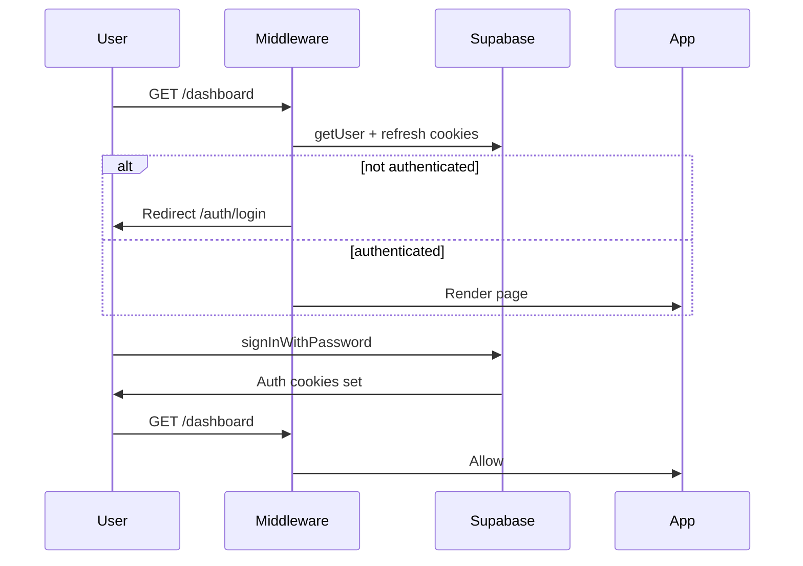

# Authentication

> Implemented May 2026. See also [changelog.md](./changelog.md).

## Overview

SavingIt uses **Supabase Auth** with email/password. Sessions are cookie-based via `@supabase/ssr`. Route protection runs in Next.js middleware.

## Files

| File | Role |
|------|------|
| [`src/lib/supabase/client.ts`](../src/lib/supabase/client.ts) | Browser client — login/signup forms |
| [`src/lib/supabase/server.ts`](../src/lib/supabase/server.ts) | Server client — server actions, RSC |
| [`src/lib/supabase/middleware.ts`](../src/lib/supabase/middleware.ts) | `updateSession()` — refresh cookies on each request |
| [`src/middleware.ts`](../src/middleware.ts) | Route guards + calls `updateSession` |
| [`src/lib/auth/routes.ts`](../src/lib/auth/routes.ts) | `isProtectedPath`, `isAuthPath` helpers |
| [`src/components/auth/login-form.tsx`](../src/components/auth/login-form.tsx) | Email/password login UI |
| [`src/components/auth/signup-form.tsx`](../src/components/auth/signup-form.tsx) | Email/password signup UI |
| [`src/app/(app)/settings/actions.ts`](../src/app/(app)/settings/actions.ts) | `logout()` server action |

## Flow



## Protected routes

Prefixes guarded when no user (via `src/lib/auth/routes.ts`):

- `/` (root)
- `/dashboard`
- `/plans`
- `/transactions`
- `/insights`
- `/settings`

## Auth-only redirects

Logged-in users visiting these paths redirect to `/dashboard`:

- `/auth/login`
- `/auth/signup`

## Login

- Client: `createClient().auth.signInWithPassword({ email, password })`
- Success: `router.refresh()` → `router.push("/dashboard")`
- Error: inline message in form

## Signup

- Client: `createClient().auth.signUp({ email, password })`
- If `data.session` exists (email confirm off): redirect to `/dashboard`
- If no session (email confirm on): show “Check your email…” message

## Logout

- Server action `logout()` in settings
- Calls `supabase.auth.signOut()` then `redirect("/auth/login")`

## Environment

Required in `.env.local`:

```
NEXT_PUBLIC_SUPABASE_URL=
NEXT_PUBLIC_SUPABASE_ANON_KEY=
```

## Supabase dashboard setup

1. Enable **Email** provider under Authentication → Providers
2. Set **Site URL** to `http://localhost:3000` for local dev
3. Add production URL when deploying to Vercel

## Not yet implemented

- Password reset
- OAuth providers
- `profiles` table + trigger on signup
- Server-side user display in Settings

## Next.js note

Next.js 16 may warn that the `middleware` file convention is deprecated in favor of `proxy`. Current `src/middleware.ts` works; migrate when upgrading patterns.
