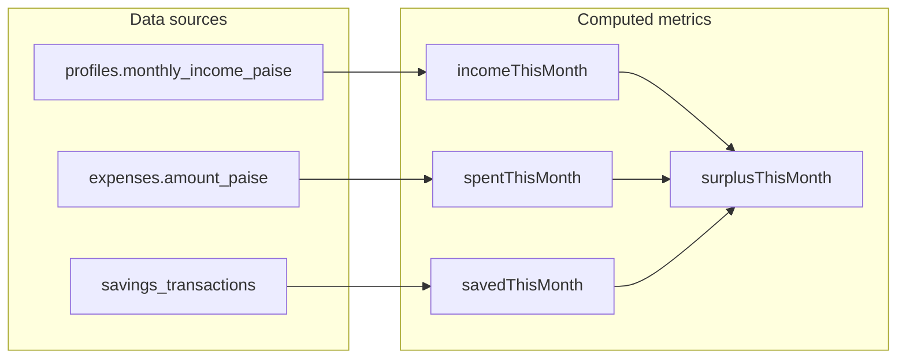

# Cash flow (v2 — planned)

> **Status:** Planned — computed in application layer; no `cashflow` table for MVP.  
> Expense ledger: [expenses.md](./expenses.md).

## Purpose

Unify **income**, **spending**, and **savings goal activity** into one monthly picture on the dashboard and (later) insights—without double-counting expenses as plan withdrawals.

## Data flow



## Formulas (calendar month, IST or user-local date)

| Metric | Formula | Notes |
|--------|---------|-------|
| `incomeThisMonth` | `profiles.monthly_income_paise` | MVP: static monthly income; no proration |
| `spentThisMonth` | `SUM(expenses.amount_paise)` where `expense_date` in month | |
| `savedThisMonth` | Net contributions to plans: contributions − withdrawals (same rules as dashboard savings) | From `savings_transactions` via existing aggregation |
| `surplusThisMonth` | `incomeThisMonth − spentThisMonth − savedThisMonth` | May be negative |

**Not included in MVP:** one-off income entries, transfers between accounts, tax, investments.

## Planned lib module

```
src/lib/cashflow/
  types.ts
  get-monthly-cashflow.ts    # parallel fetch: profile, expenses, savings tx
  aggregate-cashflow.ts      # pure functions for surplus, rates
```

Reuse:

- [`src/lib/dashboard/period-savings.ts`](../src/lib/dashboard/period-savings.ts) for savings-side month logic where possible
- [`src/lib/format-inr.ts`](../src/lib/format-inr.ts) for display

## Dashboard UI (planned)

**`CashFlowCard`** at top of [`/dashboard`](../src/app/(app)/dashboard/page.tsx):

| Row | Example |
|-----|---------|
| Income | ₹80,000 |
| Spent | ₹52,400 (tap → `/expenses`) |
| Saved to goals | ₹15,000 |
| Leftover | ₹12,600 (green) or negative (destructive) |

Extend `getDashboardData()` with one expense summary query (or parallel in `get-monthly-cashflow.ts`).

## Derived rates (Phase 6.3 — insights)

| Rate | Formula |
|------|---------|
| Savings rate | `savedThisMonth / incomeThisMonth` (if income &gt; 0) |
| Spend rate | `spentThisMonth / incomeThisMonth` |
| Surplus rate | `surplusThisMonth / incomeThisMonth` |

## Insights v2 hooks (planned)

- Narrative mentions spend vs income alongside savings health score
- Simulator: “If you reduce Food by ₹X/month, surplus increases by ₹X”
- Allocation recommender only suggests plan splits when `surplusThisMonth > 0`

## Guardrails

| Risk | Mitigation |
|------|------------|
| Double-counting | Expenses never write to `savings_transactions` |
| Missing income | Show “Set monthly income in Settings”; hide rates |
| Negative surplus | Valid state; show clearly, not as error |
| Confusion with plan withdrawals | Copy: “Spent” = life expenses; “Saved” = money moved into goals |

## Related docs

- [expenses.md](./expenses.md)
- [dashboard.md](./dashboard.md)
- [insights.md](./insights.md)
