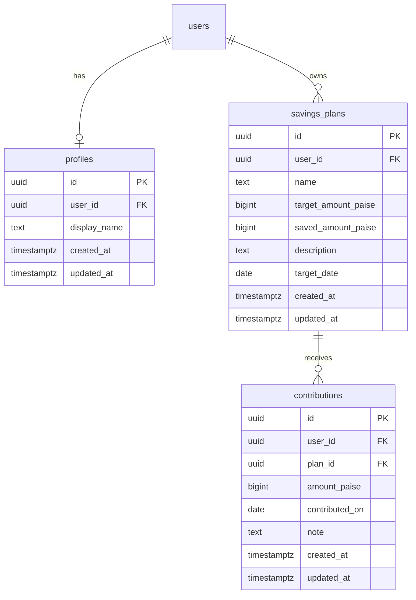

# Data Model

> **Status:** Planned — not yet migrated to Supabase. This document defines the target schema for MVP.

## Design rules

1. All monetary amounts stored as **integer paise** (`bigint` or `integer`)
2. All tables include `user_id` referencing `auth.users`
3. Row Level Security (RLS) enabled on every table
4. Timestamps in UTC (`timestamptz`)
5. Soft delete optional for v1; hard delete acceptable for plans and contributions

---

## Entity relationship



---

## Tables

### `profiles`

Extends Supabase Auth user with app-specific fields.

| Column | Type | Notes |
|--------|------|-------|
| `id` | uuid PK | Default `gen_random_uuid()` |
| `user_id` | uuid FK | Unique, references `auth.users(id)` |
| `display_name` | text | Optional |
| `created_at` | timestamptz | Default `now()` |
| `updated_at` | timestamptz | Default `now()` |

### `savings_plans`

| Column | Type | Notes |
|--------|------|-------|
| `id` | uuid PK | |
| `user_id` | uuid FK | Owner |
| `name` | text | Required, min 2 chars |
| `target_amount_paise` | bigint | Required, > 0 |
| `saved_amount_paise` | bigint | Denormalized sum; default 0 |
| `description` | text | Optional |
| `target_date` | date | Optional goal date |
| `created_at` | timestamptz | |
| `updated_at` | timestamptz | |

**Progress:** `saved_amount_paise / target_amount_paise * 100`

Alternative: compute `saved_amount_paise` via aggregate on contributions instead of denormalizing.

### `contributions`

| Column | Type | Notes |
|--------|------|-------|
| `id` | uuid PK | |
| `user_id` | uuid FK | Owner (matches plan owner) |
| `plan_id` | uuid FK | References `savings_plans(id)` |
| `amount_paise` | bigint | Required, > 0 |
| `contributed_on` | date | User-selected date |
| `note` | text | Optional |
| `created_at` | timestamptz | |
| `updated_at` | timestamptz | |

---

## RLS policies (sketch)

```sql
-- savings_plans: users manage own rows
CREATE POLICY "Users read own plans"
  ON savings_plans FOR SELECT
  USING (auth.uid() = user_id);

CREATE POLICY "Users insert own plans"
  ON savings_plans FOR INSERT
  WITH CHECK (auth.uid() = user_id);

-- Similar for UPDATE, DELETE
-- contributions: user_id must match auth.uid() and plan must belong to user
```

---

## TypeScript types (target)

```typescript
type SavingsPlan = {
  id: string;
  userId: string;
  name: string;
  targetAmountPaise: number;
  savedAmountPaise: number;
  description?: string;
  targetDate?: string;
  createdAt: string;
  updatedAt: string;
};

type Contribution = {
  id: string;
  userId: string;
  planId: string;
  amountPaise: number;
  contributedOn: string; // ISO date
  note?: string;
  createdAt: string;
  updatedAt: string;
};
```

---

## Migration order

1. `profiles` + trigger on signup
2. `savings_plans`
3. `contributions`
4. RLS policies
5. Optional: DB function to recalculate `saved_amount_paise` on contribution changes

---

## Authoritative schema (2026-05-23)

The sections above are an **early sketch**. The implemented migration supersedes them:

- Table name `contributions` → **`savings_transactions`**
- `profiles.id` references `auth.users` directly (no separate `user_id`)
- Added **`monthly_snapshots`**
- No denormalized `saved_amount_paise` on plans — use [`src/lib/calculations/savings.ts`](../src/lib/calculations/savings.ts)

See [schema.md](./schema.md) and [`supabase/migrations/001_initial_schema.sql`](../supabase/migrations/001_initial_schema.sql).
