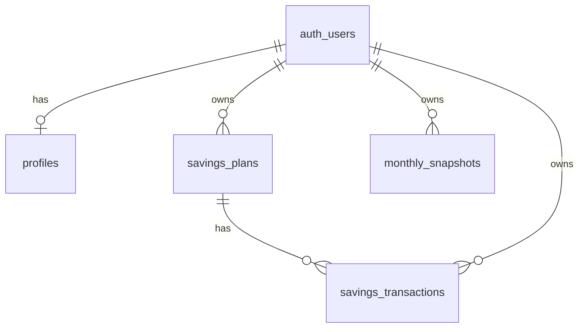

# Database Schema

> Authoritative as of migration [`supabase/migrations/001_initial_schema.sql`](../supabase/migrations/001_initial_schema.sql).  
> Apply via Supabase SQL Editor or `supabase db push`.

## Tables

| Table | Purpose |
|-------|---------|
| `profiles` | User profile; `id` = `auth.users.id` |
| `savings_plans` | Savings goals with target in paise |
| `savings_transactions` | CONTRIBUTION / WITHDRAWAL / ADJUSTMENT entries |
| `monthly_snapshots` | Aggregated monthly totals (`month` = `YYYY-MM`) |

## Money columns (all bigint paise)

- `profiles.monthly_income_paise`
- `savings_plans.target_amount_paise`
- `savings_transactions.amount_paise`
- `monthly_snapshots.total_saved_paise`, `total_target_paise`

## Key relationships

## Row Level Security

RLS enabled on all four tables. Users access only their own rows.

- **profiles:** policies on `id = auth.uid()`
- **savings_plans**, **monthly_snapshots:** policies on `user_id = auth.uid()`
- **savings_transactions:** `user_id = auth.uid()` plus INSERT/UPDATE verifies `plan_id` belongs to user

## Indexes

- `savings_plans(user_id)`
- `savings_transactions(user_id)`, `(plan_id)`, `(transaction_date)`
- `monthly_snapshots(user_id)`

## Triggers

- `handle_updated_at()` on `profiles` and `savings_plans` only

## Transaction types

| Type | App-layer effect (see [calculations.md](./calculations.md)) |
|------|-------------------------------------------------------------|
| `CONTRIBUTION` | Adds `amount_paise` |
| `WITHDRAWAL` | Subtracts `amount_paise` |
| `ADJUSTMENT` | Adds signed `amount_paise` |

## Not in migration (follow-ups)

- Auto-create `profiles` row on signup
- Denormalized `saved_amount_paise` on plans (computed in app from transactions)
- `UNIQUE (user_id, month)` on `monthly_snapshots` (optional hardening)

## TypeScript mapping (target)

DB snake_case → app camelCase when querying:

| DB column | TS field |
|-----------|----------|
| `amount_paise` | `amountPaise` |
| `transaction_type` | `transactionType` |
| `transaction_date` | `transactionDate` |
| `target_amount_paise` | `targetAmountPaise` |
